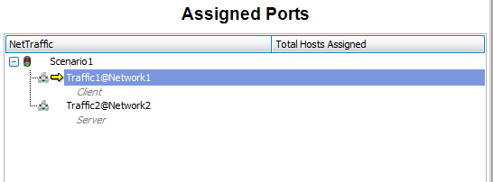

# **Ixia IxLoad Controller 1G Shell**  

Release date: August 2017

Shell version: 1.2.3

Document version: A

# In This Guide

* [Overview](#overview)
* [Downloading the Shell](#downloading-the-shell)
* [Importing and Configuring the Shell](#importing-and-configuring-the-shell)
* [Updating Python Dependencies for Shells](#updating-python-dependencies-for-shells)
* [Typical Workflow](#typical-workflow)
* [References](#references)
* [Release Notes](#release-notes)

# Overview
A shell integrates a device model, application or other technology with CloudShell. A shell consists of a data model that defines how the device and its properties are modeled in CloudShell, along with automation that enables interaction with the device via CloudShell.

**Note:** While we have an Ixia Chassis 1st gen shell, we recommend using the 2nd gen version since using a 1st gen shell may limit some shell management capabilities. For more information, see [Shell Overview – “Our Shells”](http://help.quali.com/Online%20Help/9.0/Portal/Content/CSP/LAB-MNG/Shells.htm?Highlight=shell%20overview).

### Traffic Generator Shells
CloudShell's traffic generator shells enable you to conduct traffic test activities on Devices Under Test (DUT) or Systems Under Test (SUT) from a sandbox. In CloudShell, a traffic generator is typically modeled using a chassis resource, which represents the traffic generator device and ports, and a controller service that runs the chassis commands, such as Load Configuration File, Start Traffic and Get Statistics. Chassis and controllers are modeled by different shells, allowing you to accurately model your real-life architecture. For example, scenarios where the chassis and controller are located on different machines.

For additional information on traffic generator shell architecture, and setting up and using a traffic generator in CloudShell, see the [Traffic Generators Overview](http://help.quali.com/Online%20Help/9.0/Portal/Content/CSP/LAB-MNG/Trffc-Gens.htm?Highlight=traffic%20generator%20overview) online help topic.

### **Ixia IxLoad Controller 1G Shell**
The **Ixia IxLoad Controller 1G** shell provides you with connectivity and management capabilities such as device structure discovery and power management for the **Ixia IxLoad Controller**. 

For more information on the **Ixia IxLoad Controller**, see the official **Ixia** product documentation.

The **Ixia IxLoad Controller** provides automation commands to run on the Ixia Chassis, such as Load Configuration, Start/Stop Test, Get Statistics. For more information on the Ixia Chassis shell, see the following:

* [Ixia Chassis 2G Shell](https://community.quali.com/repos/3440/ixia-chassis-2-gen-shell)

### Standard version
The **Ixia IxLoad Controller 1G** shell is based on the Traffic Shell Standard version 3.0.0.

For detailed information about the shell’s structure and attributes, see the [Traffic Shell standard](https://github.com/QualiSystems/shell-traffic-standard/blob/master/spec/traffic_standard.md) in GitHub.

### Supported OS
▪ Windows

### Requirements

Release: **Ixia IxLoad Controller 1G version 1.2.3**

▪ IxLoad client: Should be installed on the Execution Server machine.

▪ CloudShell: 7.1 and above

### Data Model

The shell's data model includes all shell metadata, families, and attributes.

#### **Ixia IxLoad Controller 1G Shell Families and Models**

The controller's families and models are listed in the following table:

|Family|Model|Description|
|:---|:---|:---|
||||
||||
||||
||||

### Automation
This section describes the automation (driver) associated with the data model. The shell’s driver is provided as part of the shell package. There are two types of automation processes, Autoload and Resource.  Autoload is executed when creating the resource in the Inventory dashboard, while resource commands are run in the Sandbox, providing that the resource has been discovered and is online.

For Traffic Generator shells, commands are configured and executed from the controller service in the sandbox, with the exception of the Autoload command, which is executed when creating the resource.

|Command|Description|
|:-----|:-----|
|Autoload|Discovers the chassis, its hierarchy and attributes when creating the resource. The command can be rerun in the **Inventory** dashboard and not in the sandbox, as for other commands.|
|Load Configuration|Loads configuration and reserves ports. Set the command input as follows: * **Ixia config file name** (ixn_config_file_name (String)): Full path to the Ixia configuration file name (rxf).|
|Start Test|Starts traffic test. Possible values: * **Blocking**: **True**: Returns after traffic finishes to run; **False**: Returns immediately|
|Stop Test|Stops traffic test.|
|Get Statistics|Gets view statistics. Possible values: * **View Name**: Name of .csv file from the IxLoad results directory (under the shell logs directory). * **Output type**: **CSV**, **JSON**. If **CSV**, the statistics will be attached to the blueprint .csv file.|

# Downloading the Shell
The **Ixia IxLoad Controller 1G** shell is available from the [Quali Community Integrations](https://community.quali.com/integrations) page. 

Download the files into a temporary location on your local machine. 

The shell comprises:

|File name|Description|
|:---|:---|
|ixia_IxLoad_controller.zip|IxLoad Controller 1G shell package|
|ixia_IxLoad_controller_offline_requirements.zip|Shell Python dependencies (for offline deployments only)|

## Importing and Configuring the Shell
This section describes how to import the Ixia IxLoad Controller 1G shell and configure and modify the shell’s devices. 

### Importing the shell into CloudShell

**To import the shell into CloudShell:**
  1. Make sure you have the shell’s zip package. If not, download the shell from the [Quali Community's Integrations](https://community.quali.com/integrations) page.
  
  2. Backup your database.
  
  3. Log in to CloudShell Portal as administrator of the relevant domain.
  
  4. In the user menu select **Import Package**.
  
     
     
  5. Browse to the location of the downloaded shell file, select the relevant *.zip* file and click **Open**. Alternatively, drag the shell’s .zip file into CloudShell Portal.

&nbsp;&nbsp;&nbsp;&nbsp;&nbsp;&nbsp;The service can now be added to a blueprint from the **Apps/Services** catalog, in the Networking category.  

### Offline installation of a shell

**Note:** Offline installation instructions are relevant only if CloudShell Execution Server has no access to PyPi. You can skip this section if your execution server has access to PyPi. For additional information, see the online help topic on offline dependencies.

In offline mode, import the shell into CloudShell and place any dependencies in the appropriate dependencies folder. The dependencies folder may differ, depending on the CloudShell version you are using:

* For CloudShell version 8.3 and above, see [Adding Shell and script packages to the local PyPi Server repository](#adding-shell-and-script-packages-to-the-local-pypi-server-repository).

* For CloudShell version 8.2, perform the appropriate procedure: [Adding Shell and script packages to the local PyPi Server repository](#adding-shell-and-script-packages-to-the-local-pypi-server-repository) or [Setting the python pythonOfflineRepositoryPath configuration key](#setting-the-python-pythonofflinerepositorypath-configuration-key).

* For CloudShell versions prior to 8.2, see [Setting the python pythonOfflineRepositoryPath configuration key](#setting-the-python-pythonofflinerepositorypath-configuration-key).

### Adding shell and script packages to the local PyPi Server repository
If your Quali Server and/or execution servers work offline, you will need to copy all required Python packages, including the out-of-the-box ones, to the PyPi Server's repository on the Quali Server computer (by default *C:\Program Files (x86)\QualiSystems\CloudShell\Server\Config\Pypi Server Repository*).

For more information, see [Configuring CloudShell to Execute Python Commands in Offline Mode](http://help.quali.com/Online%20Help/9.0/Portal/Content/Admn/Cnfgr-Pyth-Env-Wrk-Offln.htm?Highlight=Configuring%20CloudShell%20to%20Execute%20Python%20Commands%20in%20Offline%20Mode).

**To add Python packages to the local PyPi Server repository:**
  1. If you haven't created and configured the local PyPi Server repository to work with the execution server, perform the steps in [Add Python packages to the local PyPi Server repository (offlinemode)](http://help.quali.com/Online%20Help/9.0/Portal/Content/Admn/Cnfgr-Pyth-Env-Wrk-Offln.htm?Highlight=offline%20dependencies#Add). 
  
  2. For each shell or script you add into CloudShell, do one of the following (from an online computer):
      * Connect to the Internet and download each dependency specified in the *requirements.txt* file with the following command: 
`pip download -r requirements.txt`. 
     The shell or script's requirements are downloaded as zip files.

      * In the [Quali Community's Integrations](https://community.quali.com/integrations) page, locate the shell and click the shell's **Download** link. In the page that is displayed, from the Downloads area, extract the dependencies package zip file.

3. Place these zip files in the local PyPi Server repository.
 
### Setting the python PythonOfflineRepositoryPath configuration key
Before PyPi Server was introduced as CloudShell’s python package management mechanism, the `PythonOfflineRepositoryPath` key was used to set the default offline package repository on the Quali Server machine, and could be used on specific Execution Server machines to set a different folder. 

**To set the offline python repository:**
1. Download the *ixia_IxLoad_controller_offline_requirements.zip* file, see [Downloading the Shell](#downloading-the-shell).

2. Unzip it to a local repository. Make sure the execution server has access to this folder. 

3.  On the Quali Server machine, in the *~\CloudShell\Server\customer.config* file, add the following key to specify the path to the default python package folder (for all Execution Servers):  
	`<add key="PythonOfflineRepositoryPath" value="repository 
full path"/>`

4. If you want to override the default folder for a specific Execution Server, on the Execution Server machine, in the *~TestShell\Execution Server\customer.config* file, add the following key:  
	`<add key="PythonOfflineRepositoryPath" value="repository 
full path"/>`

5. Restart the Execution Server.

### Configuring a new service
This section explains how to set the controller's default values in the service. 

The controller service enables end users to run load configuration, start and stop test traffic and get test statistics. 

For more information, see [Services Overview](#http://help.quali.com/Online%20Help/9.0/Portal/Content/CSP/LAB-MNG/Services.htm?Highlight=services).

**To configure a service for the device:**
  1. In CloudShell Resource Manager, in the **Admin** tab, click **Resource Families**. 
          
  2. In the **Traffic Generator Controller** folder, select **IxLoad Controller**.
  
   &nbsp;&nbsp;&nbsp;&nbsp;&nbsp;&nbsp;
  
  3. In the **Attributes** tab, enter the **Default Values** for the **IxLoad Controller** service as follows:
  
     * Client Install Path - The path in which the traffic client is installed on the Execution Server, for example *C:/Program Files (x86)/Ixia/IxOS/8.01-GA*.
     * Controller Address - The IP address of the API server. Default is localhost.
              
  4. Click **Save**.
  
CloudShell validates the device’s settings and updates the new resource with the device’s structure (if the device has a structure).

# Updating Python Dependencies for Shells
This section explains how to update your Python dependencies folder. This is required when you upgrade a shell that uses new/updated dependencies. It applies to both online and offline dependencies.

### Updating offline Python dependencies
**To update offline Python dependencies:**
1. Download the latest Python dependencies package zip file locally.

2. Extract the zip file to the suitable offline package folder(s). 

3. Restart any execution server that has a live instance of the relevant driver or script. This requires running the Execution Server's configuration wizard, as explained in the [Configure the Execution Server](http://help.quali.com/doc/9.0/CS-Install/content/ig/configure%20cloudshell%20products/cfg-ts-exec-srver.htm?Highlight=configure%20the%20execution%20server) topic of the CloudShell Suite Installation guide. 

### Updating online Python dependencies
In online mode, the execution server automatically downloads and extracts the appropriate dependencies file to the online Python dependencies repository every time a new instance of the driver or script is created.

**To update online Python dependencies:**
* If there is a live instance of the shell's driver or script, restart the execution server, as explained above. If an instance does not exist, the execution server will download the Python dependencies the next time a command of the driver or script runs.

# Typical Workflow 

**Workflow 1** - *Using the IxLoad controller to run IxLoad traffic* 

1. In CloudShell Portal, in the top left section of the **Blueprint Catalog**, click **+ Create Blueprint**.

2. In the blueprint toolbar, click **Resource** and drag the Ixia Chassis resource into the diagram.

	1. Add the required number of Ixia Chassis resource ports to the blueprint. The number of Ixia Chassis resource ports in the blueprint should match the number of ports in the IxNetwork configuration. 
	For example: if you have a configuration with two ports:
	
		&nbsp;&nbsp;&nbsp;&nbsp;&nbsp;&nbsp;

	2. Hover over the Ixia Chassis resource and select **More Options>Add sub-resource** from the context menu. 
	3. Use the search and filtering options to find the port resources you want to use.
	4. Select the port resources from the pane and drag them into the workspace. The ports are displayed in the **Resource Structure** tab of the chassis resource.
	
		&nbsp;&nbsp;&nbsp;&nbsp;&nbsp;&nbsp;&nbsp;&nbsp;&nbsp;&nbsp;&nbsp;&nbsp;

3. In the blueprint toolbar, click **App/Service>Traffic Generator Controllers** and drag the **IxLoad Controller** service into the diagram.

4. Reserve the blueprint.

6. Edit the **IxLoad Controller** service parameters if required, see [Configuring a new service](#configuring_a_new_service).

&nbsp;&nbsp;&nbsp;&nbsp;&nbsp;&nbsp;

7. Map the configuration ports to the blueprint ports. For each port in the IxLoad configuration, assign a physical port from the ports in the blueprint. 
	1. Hover over the Ixia chassis resource and select **Structure** from the context menu. The **Resource Structure** side pane is displayed, listing the resource ports. 
	2. For each port, click the down arrow and select **Attributes**.
	3. Set the **Logical Name** to the port name in the IxLoad configuration.

	&nbsp;&nbsp;&nbsp;&nbsp;&nbsp;&nbsp;

# References
To download and share integrations, see [Quali Community's Integrations](https://community.quali.com/integrations). 

For instructional training and documentation, see [Quali University](https://www.quali.com/university/).

To suggest an idea for the product, see [Quali's Idea box](https://community.quali.com/ideabox). 

To connect with Quali users and experts from around the world, ask questions and discuss issues, see [Quali's Community forums](https://community.quali.com/forums). 

# Release Notes 

### Known Issues
• All Execution Servers that run Sandboxes with the IxLoad controller should have the same Client Install Path. Therefore, all Execution Servers must be either Windows or Linux.

• IxLoad can run up to two instances per machine (Execution Server). If there are more than two instances running, **Load Configuration** of any additional reservations will eventually fail due to timeout.
